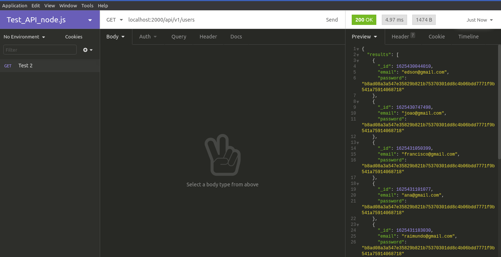
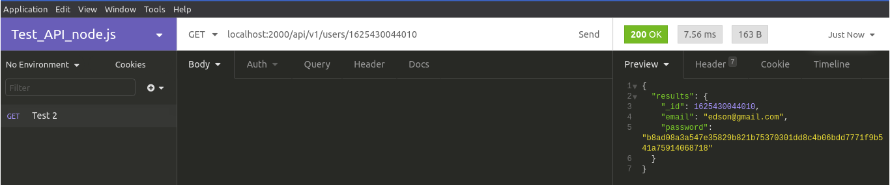
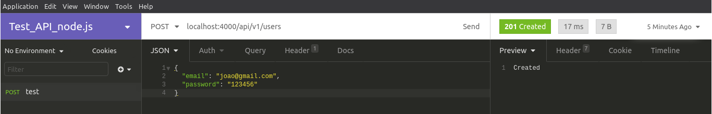
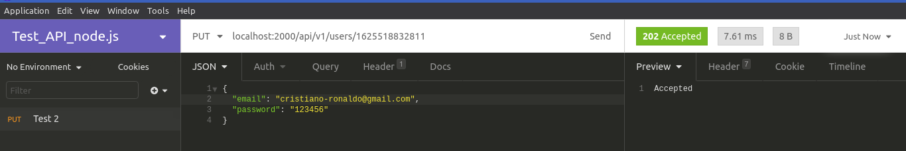
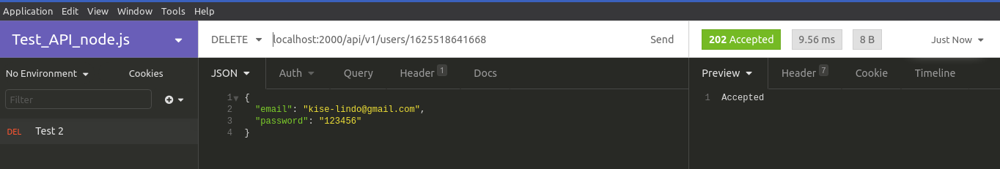
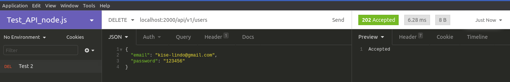
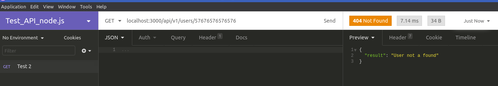
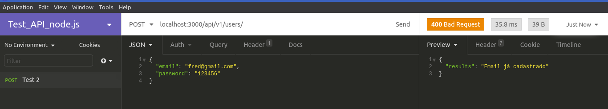
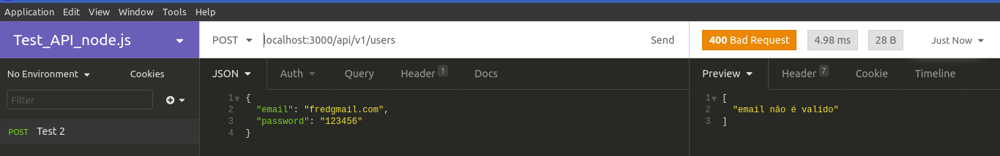

# Projeto API REST FUL com NODEJS

## Conteúdo: 

Neste projeto estou abordando uma API **restful**, usando as principais queries (SELECT, INSERT, UPDATE, DELETE) em suas devidas rotas (GET, POST, PUT, DELETE), não estou utilizando um banco de dados e sim um arquivo estático `.json` para cumprir o desafio!  mas eu abordei os métodos e o uso deles de forma clara e objetiva para que fosse fácil a compreensão dos métodos e entender a função de cada um.  

HTTP | ROUTE | BODY | DESCRIÇÃO |
| --- | ------ | ------ |  ------ |
| GET | /api/v1/users/user_id | | Esta rota serve para pegar os dados dos usuários contidos no `data.json`, ao passar um ID como um parâmetro na rota, será retornado os dados do usuário referente aquele ID, mas caso não passe nenhum ID a API retornará todos os usuários e seus respectivos dados. Ambos com **statusCode(200)OK**
| POST | /api/v1/users | JSON (email,password) | Esta rota é a de criação de usuário. Aqui você precisa enviar dois dados para a criação do usuário: Email e senha, caso a requisição seja insuficiente retornará um **statusCode(400) bad request** significando que algum dado está faltando ou não passou no sistema de validação. Mas caso sejam enviados os dados de forma satisfatória o resultado é o **statusCode(201) created** exibindo que a criação do usuário foi efetuada com sucesso sem falhas no processo. 
| PUT | /api/v1/users/user_id | JSON (email,password) | Esta é a rota de edição de usuários. Uma das rotas que eu como desenvolvedor mais prestaria atenção ! Para efetuar a edição de forma satisfatória primeiro temos que enviar o ID do usuário que será editado pela rota, logo após pode ser enviado o email e a senha para que tais sejam alterados, porém o email e senha devem ser passados como Body na api usando um formulário ou até mesmo um Json/Fetch ! em caso de insatisfação será retornado um **statusCode(400) bad request** mas se todos os dados forem satisfatórios a API retornará **statusCode(202) accepted** mostrando que os dados foram aceitos para a edição do usuário.
| DELETE | /api/v1/users/user_id | | Esta é a última mas não menos importante (Na verdade bastante importante !) a rota de exclusão de usuário(s). Essa rota é muito simples de ser implementada… mas prestar atenção com ela é crucial ! pois ela pode apagar todos os usuários em questão de milissegundos então preste atenção em como evitar isso, primeiro, se quiser excluir um usuário em específico, pegue seu ID e passe como parâmetro de rota, mas caso queira apagar todos os usuários apenas coloque a rota sem passar qualquer valor, dentro de instantes você terá apagado  o(s) usuário(s) do json.  

## Estrutura do projeto: UseCases, Repository & Router 

### Essas são as pastas principais do projeto, mas por que usar essa estrutura ? Eu vou separar em pontos para um melhor entendimento.

* **UseCases**: Ajuda a separar responsabilidades no código. (Por exemplo: tenho 4 useCases cada um com uma função distinta (pegar, criar, alterar e apagar) nenhum dos arquivos passa de 25 linhas de código, dessa forma fica muito mais fácil fazer refatoração, criação de novos métodos, separação de responsabilidade, simplicidade no código,  debugar código de forma fácil, etc. ou seja, muito útil ). 

* **Router**: Ele é como se fosse uma ponte entre o usuário e o servidor ou seja um motivo bem forte para dizer um pouco sobre ele. Com exatas 15 linhas, e sim, o router deve ser o menos complexo possível ! ele deve ser legível e simples. não preciso falar muito por ser simples, mas vale a pena o destaque.

* **Repository**: Nele fica toda a responsabilidade de controle de banco de dados (no meu caso é um arquivo `.json` mas também é válido) é muito bom usá lo para poder migrar de bancos relacionais para não relacionais e de arquivos estáticos para bancos e assim por diante. (Exemplo, caso eu queira migrar do MySQL para o mongoDB eu só preciso alterar o `UserRepository.js` e configurá lo para ter uma conexão com mongo, isso é bom por não afetar os demais arquivos do programa).

## Performance da API: 

### Por usar apenas o express e ter feito outros serviços usando apenas o javascript isso gerou uma performance muito grande no NodeJS (mas tenham em mente que o NodeJS já é absurdamente rápido por padrão).

## Rota GET que pega todos os usuários:

## Rota GET que pega um usuário em especifico:

## Rota POST que cria usuários:

## Rota PUT que edita os usuários:

## Rota DELETE que deleta um usuário: 

## Rota DELETE que deleta todos os usuários:

## Sistema de validação da API

### Visto que ataques hackers estão acontecendo com mais frequência... uma validação nas rotas foi implementada para cada caso de erro de mal uso das rotas. Isso ajuda o front-end na hora de mostrar em UI (user interface/ interface do usuário **geralmente no navegador**) para o cliente, visto isso vamos dar uma analisada nas validações.

### **Em caso de erro na hora de passar o id para obter os dados do usuário em especifico, na hora de editar o usuário ou até mesmo na hora de deletar o usuário será retornado um statusCode(404) informando que usuário não foi achado:**

### **Caso queira criar um usuário e ele tenha um email idêntico ao de algum usuário já cadastrado isso retornará um statusCode(400) informando que Email já está cadastrado:**

### **Caso o email seja inválido, a API retornará um statusCode(400) informando um email inválido:**

### **Caso a senha tenha menos de 4 digitos será retornado um statusCode(400) senha muito curta:**

## Dicionário 

> **Restful:** Uma API restful é um conjunto de regras para criação de tal fazendo ela ser mais legível entre os desenvolvedores. 
Exemplos:

* Use status referentes a cada requisição ou resposta 
* Use methods a sua respectiva função

METHOD | ENDPOINT | STATUS | DEFINIÇÃO |
| --- | ------ | ------ |  ------ |
| GET | https://api/v1/users/22 | statusCode(404) | User not a found |
| POST| https://api/v1/users | statusCode(201) | User created |

> **Endpoint:** Um endpoint nada mais é que as rotas da API, todas ! independentes de suas funções ou métodos as rotas são endpoint. por exemplo:
GET `https://minhaapi.com/api/v1/users` Isso é um endpoint 
DELETE `https://minhaapi/api/v1/users/4465454165156`

## Curiosidades 

Caso você se pergunte por que tem uma função chamada `returnUiid` ela serve para formatar o `_id` de forma elegante, e tambem deixalos únicos na aplicação. 